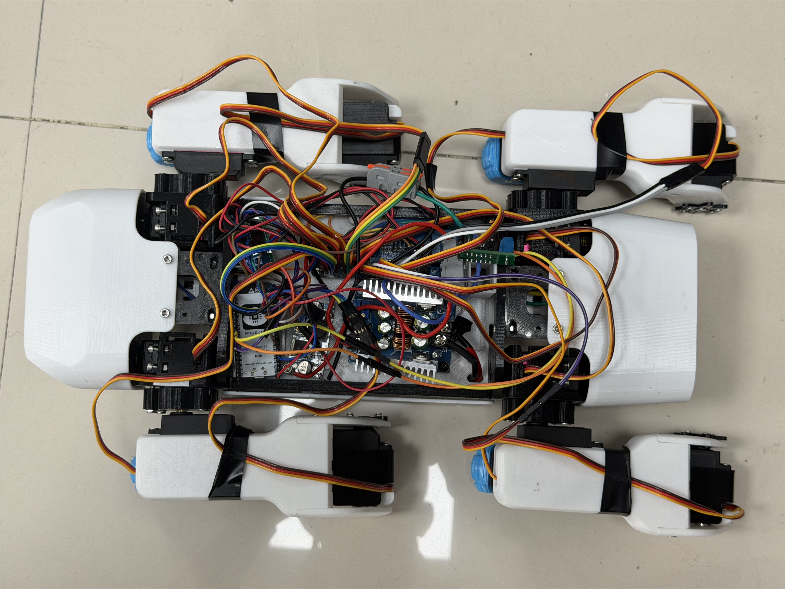
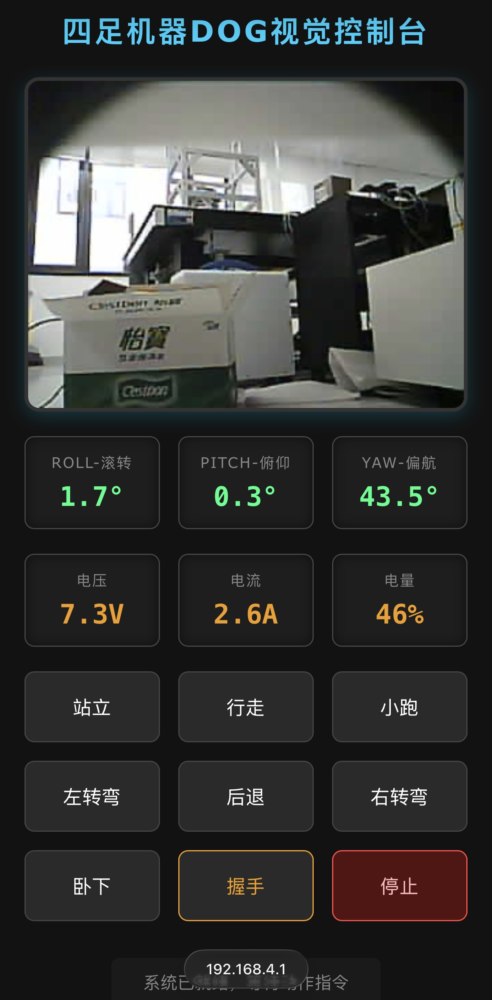

# ESP32 四足机器人控制器

> 基于 ESP32 + FreeRTOS 的 SpotMicro 四足机器人，实现 50Hz 实时控制环、三自由度逆运动学解算与贝塞尔曲线步态规划。

<!-- 在下方替换为你的实拍图片/视频链接 -->
<p align="center">
  
</p>
<p align="center">
  
</p>
<p align="center">
  <video src=" https://github.com/user-attachments/assets/468628a1-0487-466f-b019-bb2a74865498" width="600" controls></video>
</p>


---

## 技术亮点

### 双核实时架构

| 核心 | 优先级 | 职责 | 周期 |
|------|--------|------|------|
| Core 1 | 5 (高) | 控制环：指令解析 → 传感器采集 → 逆运动学 → 舵机驱动 | 20ms (50Hz) |
| Core 0 | 1 (低) | 遥测环：IMU 数据上报、电池安全监控 | 1000ms |

- 基于 `vTaskDelayUntil` 的硬实时调度，保证控制环严格 20ms 周期
- `WARN_IF_SLOW` 宏实时监控每次迭代是否超时
- 控制环与遥测环核心隔离，互不干扰

### FreeRTOS 任务设计

```
setup()                          ← Core 0，初始化硬件
  └─ xTaskCreatePinnedToCore()   ← 将控制任务钉在 Core 1
       └─ SpotControlLoopEntry() ← 50Hz 控制环
loop()                           ← Core 0，低优先级遥测
```

### I2C 多设备总线管理

同一 I2C 总线 (SDA=18, SCL=19) 上挂载三个设备：
- **PCA9685** (0x40) — 12路 PWM 舵机驱动
- **MPU6050** (0x68) — 六轴 IMU
- **QMC5883L** (0x0D) — 磁力计

在 50Hz 循环中按序访问，无总线冲突。

### UART 双向通信协议

ESP32 主控与 ESP32-CAM 模块通过 UART1 通信：
- **下行**：CAM 发送模式指令（WALK / STAND / LIE）
- **上行**：主控回传 IMU 姿态角 + 电池状态，用于 CAM 端 OSD 叠加显示

---

## 运动控制系统

### 50Hz 控制流水线

```
CAM.readCamSerial()        → 解析 UART 指令
motionService.handleMode() → 状态机切换
peripherals.update()       → 采集 IMU / 罗盘 / 超声波
motionService.update()     → 步态规划 + 逆运动学解算 → 12 个关节角度
servoController.update()   → lerp 平滑 → PWM 输出
```

### 三自由度逆运动学

每条腿 3 个关节（髋关节旋转、膝关节俯仰、踝关节俯仰），解析式 IK 求解：

```
legIK(x, y, z) → [θ_hip, θ_knee, θ_ankle]

关键参数：
  coxa  = 60.5mm    femur = 111.2mm    tibia = 118.5mm
  机体   = 207.5 × 78mm
```

- `body_state_t` 包含 6-DOF 机体姿态 + 4×4 足端位置矩阵
- IK 解算器内置状态缓存，`body_state` 未变化时直接跳过计算

### 贝塞尔曲线步态规划

- **TROT 步态**：对角腿同步摆动，`speed_factor=2`
- **CRAWL 步态**：单腿依次摆动，带重心追踪（基于支撑三角形质心），`speed_factor=0.5`

摆动相使用 11 阶贝塞尔曲线生成平滑足端轨迹，预计算组合数值避免运行时开销。

### 状态机架构

```
MotionService
  ├─ RestState   — 趴下（最低高度）
  ├─ StandState  — 站立就绪
  └─ WalkState   — 行走（TROT / CRAWL）
```

状态间通过 `lerpToBody()` 实现平滑过渡，支持 IMU 补偿（0.15 混合因子低通滤波抑制姿态漂移）。

---

## 硬件架构

### 系统框图

```
┌──────────────┐   UART    ┌──────────────┐
│  ESP32-CAM   │◄─────────►│   ESP32 主控  │
│  (视觉/指令)  │           │  (运动控制)    │
└──────────────┘           └──────┬───────┘
                                  │
            ┌─────────────────────┼─────────────────────┐
            │ I2C                 │ GPIO                 │ ADC
     ┌──────┴──────┐      ┌──────┴──────┐        ┌──────┴──────┐
     │  PCA9685    │      │  超声波 ×2   │        │  电池监控    │
     │  12路舵机    │      │  L: 33/34   │        │  V: GPIO36  │
     │  MPU6050    │      │  R: 32/35   │        │  I: GPIO39  │
     │  QMC5883L   │      └─────────────┘        │  继电器: 27  │
     └─────────────┘                             └─────────────┘
```

### 电池安全系统

- 2S LiPo，电压分压比 5.463×，电流检测 0.066 V/A
- EMA 指数滑动平均滤波
- 硬件继电器保护：过流 >25A 或欠压 <4.4V 自动断电

---

## 快速开始

### 环境要求

- [PlatformIO](https://platformio.org/) (CLI 或 VSCode 插件)
- ESP32 NodeMCU-32S 开发板

### 编译 & 烧录

```bash
# 编译
pio run

# 烧录
pio run -t upload

# 串口监控 (115200 baud)
pio device monitor
```

## 项目结构

```
src/main.cpp               ← 入口：FreeRTOS 任务创建 + 主循环
lib/Kinematics/            ← 逆运动学解算器 + 数学工具
lib/Motion/                ← MotionService 状态机 + 步态时序
lib/peripherals/           ← 传感器抽象 + 舵机控制 + 电池监控
lib/CamSerial/             ← ESP32-CAM UART 通信协议
include/motion_states/     ← 状态模式：REST / STAND / WALK 实现
```

## 技术栈

`C++17` · `FreeRTOS` · `PlatformIO` · `Arduino Framework` · `ESP32` · `PCA9685` · `MPU6050` · `逆运动学` · `贝塞尔曲线步态`
